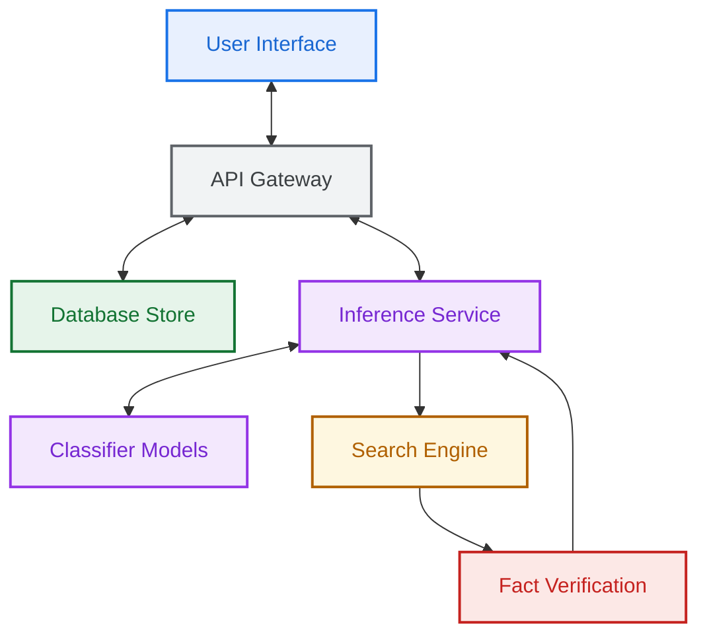
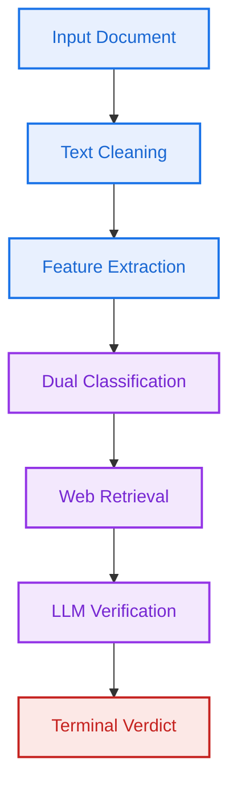

<div align="center">

# 🧠 NewsPulse
### AI-Powered Fake News Detection Platform

**NewsPulse** is a full-stack, enterprise-grade hybrid AI application that detects fake news and factual misinformation by combining deep NLP transformers with real-time web fact-checking via Google Gemini.

[](https://opensource.org/licenses/MIT)
[](https://python.org)
[](https://nodejs.org)
[](https://react.dev)
[](https://fastapi.tiangolo.com)
[](https://www.mongodb.com/cloud/atlas)

</div>

---

## 🖼️ System Architecture




---

## ✨ Key Features

| Feature | Description |
|---|---|
| 🔬 **Hybrid Detection** | Combines TF-IDF + Logistic Regression, RoBERTa transformer, and DistilBERT fallback in a dual-model parallel pipeline |
| 🌐 **Live Fact-Checking** | Queries DuckDuckGo for real-time web context and passes results to Google Gemini for LLM-based factual analysis |
| ⚡ **State Override Protocol** | If the LLM detects empirical contradictions, it overrides the ML classification to `FAKE` regardless of linguistic confidence |
| 💡 **Explainable AI** | Returns highlighted suspicious keywords and human-readable reasons for every classification verdict |
| 📊 **Analytics Dashboard** | Tracks personal scan history, fake/real ratios, and weekly scan trends with interactive Recharts graphs |
| 🤖 **AI Chatbot** | In-app assistant powered by Groq/Llama 3 to answer questions about fake news and NLP |
| 📁 **File Upload** | Supports PDF and TXT article uploads in addition to text paste and URL scanning |
| 🔐 **Secure Auth** | JWT-based authentication with email/password reset flow via Gmail SMTP |

---

## ⚙️ Methodology Flowchart




---

## 🛠️ Tech Stack

| Layer | Technology |
|---|---|
| **Frontend** | React 18, Vite, Tailwind CSS, Framer Motion, Recharts |
| **Backend API** | Node.js, Express 5, MongoDB, Mongoose, JWT |
| **ML Service** | Python 3.10, FastAPI, HuggingFace Transformers, RoBERTa, PyTorch |
| **AI / LLM** | Google Gemini API, Groq (Llama 3.3-70B) |
| **Search** | DuckDuckGo Search API |
| **Database** | MongoDB Atlas (M0 Free Tier) |
| **Security** | express-rate-limit, express-mongo-sanitize, helmet, bcrypt |

---

## 🚀 Local Setup (No Docker)

### Prerequisites
- **Node.js** v18+ and npm
- **Python** 3.10+ and pip
- **MongoDB** running locally on port `27017` *or* a [MongoDB Atlas](https://mongodb.com/cloud/atlas) cluster

---

### Step 1 — Clone the Repository
```bash
git clone https://github.com/your-username/NewsPulse.git
cd NewsPulse
```

### Step 2 — Configure Environment Variables


---

### Step 3 — Start the ML Inference Service
```bash
cd ml_model
python -m venv venv
.\venv\Scripts\Activate.ps1    # Windows
# source venv/bin/activate     # macOS/Linux

pip install -r requirements.txt
python main.py
# ✅ Running at http://localhost:5001
```

### Step 4 — Start the Backend API
```bash
cd backend
npm install
npm run dev
# ✅ Running at http://localhost:5000
```

### Step 5 — Start the Frontend
```bash
cd frontend
npm install
npm run dev
# ✅ Open http://localhost:5173
```

---

## 💡 Usage

1. Open `http://localhost:5173` and register an account.
2. Paste a news article, enter a URL, or upload a PDF/TXT file.
3. Click **"Start Scan"** — the hybrid pipeline runs in seconds.
4. Review the verdict, confidence score, highlighted bias words, and LLM fact-check explanation.
5. Use the **💬 chatbot** (bottom-right) to ask questions about the results.

---


---


---

## 📄 License

This project is licensed under the **MIT License** — see the [LICENSE](LICENSE) file for details.

---

<div align="center">
Built with ❤️ by <strong>Talat Siddiqui</strong> · <a href="mailto:talatsiddiqui028@gmail.com">talatsiddiqui028@gmail.com</a>
</div>
